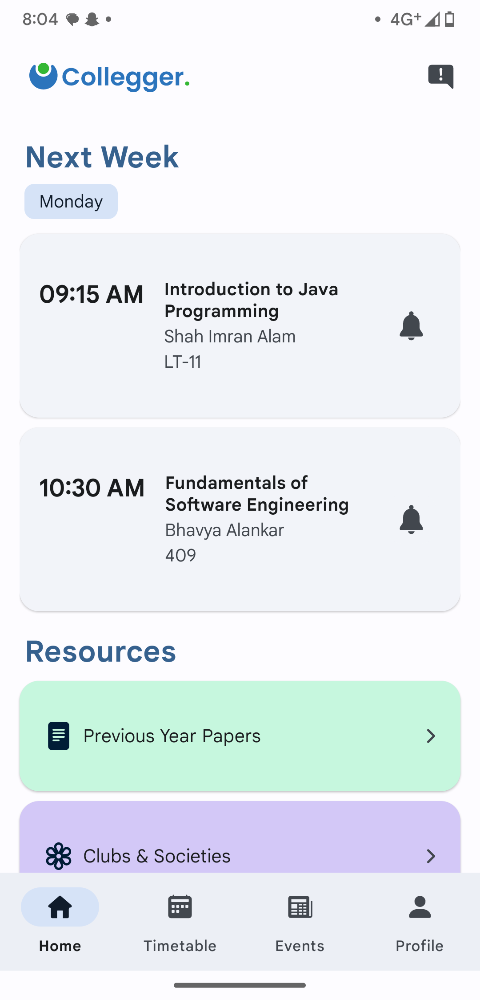
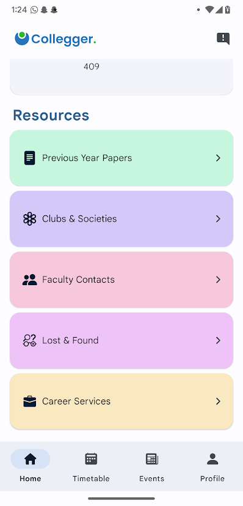
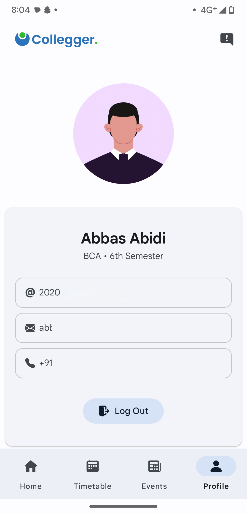
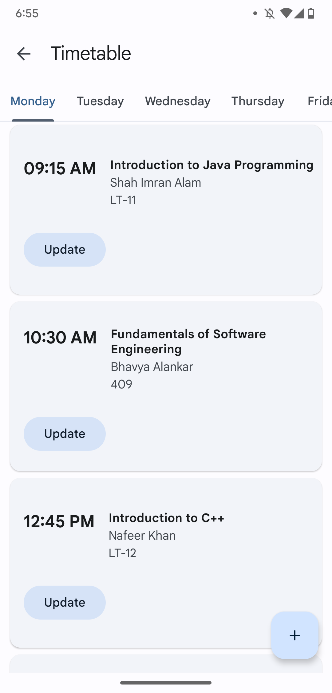
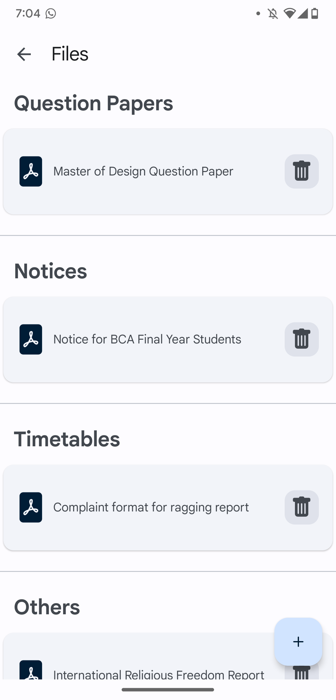

# Colleger - A College Community App

The project objective of the Colleger- College Community App is to create a centralized platform that facilitates seamless communication and enhances engagement within the college community. 

### Features
- **Class Schedule (Timetable)**
- **Events & News**
- **Documents (Resources i.e Previous Year Question Papers, Performas, Notices etc)**
- **Clubs & Societies**
- **Faculty Contacts**
- **Lost & Found**
- **Career Services**
- **Complaints**

### Backend
- **I have used Firebase as backend, implemented phone authentication for verification of users**
- **Import bulk user info i.e spreadsheet from google sheets via Google App Script directly into your Firebase Realtime Database**

- **After importing user info we can register the user to the app and create the user account**
- **Don't forget to add your own** _google-services.json_ **file into the project directory**
- **The app has implemented account roles i.e** _admin_ **and** _user_, **based upon the account roles the the user will be redirected to the respective activity**

### App Screenshots
- ### **User**

    
    
    
    
    
    
    

- ### **Admin**

    
    
    
    
    
    
    

